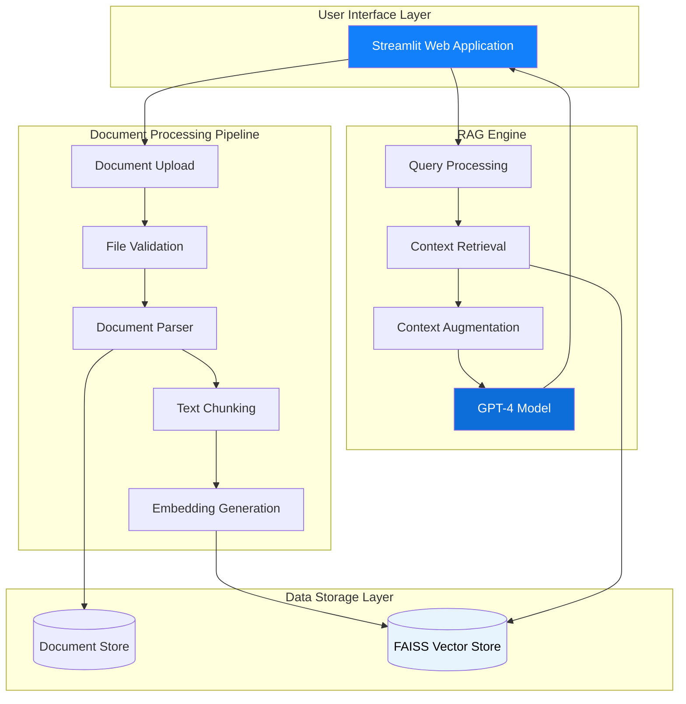
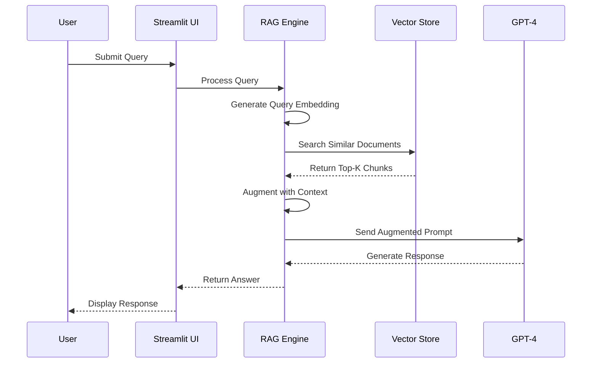
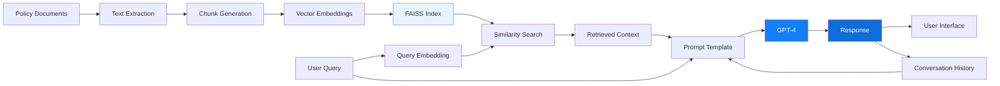

# PEP Merchandising Intelligence Hub

A Retrieval-Augmented Generation (RAG) system designed to provide instant access to PEP's merchandising policies, buying procedures, supplier information, and performance metrics. Built with Streamlit, LangChain, and OpenAI GPT-4.

[](https://www.python.org/downloads/)
[](https://streamlit.io/)
[](https://www.langchain.com/)
[](#license)

---

## Table of Contents

- [Overview](#overview)
- [Features](#features)
- [System Architecture](#system-architecture)
- [Installation](#installation)
- [Configuration](#configuration)
- [Knowledge Base](#knowledge-base)
- [Usage](#usage)
- [Testing](#testing)
- [Deployment](#deployment)
- [Project Structure](#project-structure)
- [Technical Documentation](#technical-documentation)
- [Troubleshooting](#troubleshooting)
- [Contributing](#contributing)
- [License](#license)

---

## Overview

The PEP Merchandising Intelligence Hub is an internal business intelligence tool designed for PEP South Africa's Buying, Planning, and Merchandising teams. As South Africa's largest single brand retailer, PEP requires efficient access to critical operational knowledge including buying procedures, supplier directories, pricing strategies, and compliance standards.

This system uses advanced natural language processing to enable teams to query complex business documentation through conversational interfaces, eliminating time spent searching through policy documents and manuals.

### Target Users

- Buying Teams
- Planning & Merchandising Professionals
- Category Managers
- Supplier Relationship Managers
- Compliance Officers

### Key Capabilities

- Natural language queries about merchandising policies
- Instant retrieval of supplier contact information
- Quick access to approval workflows and thresholds
- Performance benchmark and KPI references
- Pricing margin calculations and guidelines

---

## Features

### Core Functionality

**Intelligent Document Search**
- Vector-based semantic search across all merchandising documentation
- FAISS (Facebook AI Similarity Search) for high-performance retrieval
- Context-aware responses using GPT-4
- Maintains conversation history for follow-up questions

**Knowledge Management**
- Multi-format document support (TXT, PDF, DOCX, Markdown)
- Automatic document validation and processing
- Vector store persistence for fast query response
- Atomic file operations to prevent data corruption

**Business Intelligence**
- Buying procedures and approval hierarchies
- Vendor directory with contact information and terms
- Pricing strategies and margin calculations
- Performance metrics and benchmarks
- Compliance standards and quality requirements
- Merchandising guidelines and best practices

### User Experience

**Professional Interface**
- PEP corporate branding (Azure Radiance #1180FA)
- Clean, business-focused design
- Responsive layout for desktop and tablet use
- Document management sidebar
- Session persistence

**Session Management**
- Conversation history maintained throughout session
- Clear chat functionality for new queries
- Message display with user/assistant differentiation

---

## System Architecture

### High-Level Architecture



### RAG Pipeline Flow



### Data Flow



---

## Installation

### Prerequisites

- Python 3.11 or higher
- OpenAI API key with GPT-4 access
- Git
- Windows, macOS, or Linux operating system

### Step-by-Step Installation

**1. Clone the Repository**

```bash
git clone https://github.com/Kayanja2023/RAG-PEP-AI-MERCHENDISING-HUB.git
cd RAG-PEP-AI-MERCHENDISING-HUB
```

**2. Create Virtual Environment**

```bash
# Windows
python -m venv .venv
.venv\Scripts\activate

# macOS/Linux
python3 -m venv .venv
source .venv/bin/activate
```

**3. Install Dependencies**

```bash
pip install --upgrade pip
pip install -r requirements.txt
```

**4. Configure Environment Variables**

Create a `.env` file in the root directory:

```env
OPENAI_API_KEY=your_openai_api_key_here
```

**5. Verify Installation**

```bash
# Run tests to verify setup
python -m unittest discover -s tests -p "test_*.py"
```

**6. Launch Application**

```bash
streamlit run app.py
```

The application will open in your default browser at `http://localhost:8501`

---

## Configuration

### Application Settings

Edit `config.py` to customize system behavior:

```python
# Document Processing Configuration
CHUNK_SIZE = 1000           # Characters per text chunk
CHUNK_OVERLAP = 200         # Overlap between consecutive chunks
MAX_FILE_SIZE = 52428800    # Maximum upload size (50MB)

# AI Model Configuration
MODEL = "gpt-4"             # OpenAI model identifier
TEMPERATURE = 0.7           # Response creativity (0.0 - 1.0)
SEARCH_K = 3                # Number of context chunks to retrieve

# File Support
ALLOWED_EXTENSIONS = ["txt", "pdf", "docx", "md"]
```

### Directory Structure

```python
DOCS_DIR = "data/documents"      # Knowledge base storage
FAISS_DIR = "data/faiss_store"   # Vector embeddings storage
```

### Environment Variables

| Variable | Required | Description |
|----------|----------|-------------|
| `OPENAI_API_KEY` | Yes | OpenAI API authentication key |
| `MODEL` | No | Override default GPT model |
| `TEMPERATURE` | No | Override default temperature |

---

## Knowledge Base

### Pre-Loaded Documentation

The system includes comprehensive PEP merchandising documentation:

| Document | Content | Purpose |
|----------|---------|---------|
| `pep-buying-procedures.md` | Purchase order workflows, approval hierarchies, authorization thresholds | Operational guidance for buying teams |
| `pep-compliance-standards.md` | Quality requirements, regulatory compliance, audit procedures | Compliance and quality assurance |
| `pep-merchandising-guidelines.md` | Category management, product planning, range architecture | Strategic merchandising direction |
| `pep-performance-benchmarks.md` | KPIs, targets, performance metrics, success criteria | Performance measurement and tracking |
| `pep-pricing-margins.md` | Pricing formulas, margin targets, markdown policies | Financial and pricing strategy |
| `pep-vendor-directory.md` | Supplier contacts, lead times, payment terms, quality ratings | Supplier relationship management |

**Total Knowledge Base**: Approximately 15,000+ words covering PEP's merchandising operations.

### Adding Documents

**Via User Interface:**
1. Navigate to sidebar "Knowledge Base Management"
2. Click "Upload Documents"
3. Select supported file formats
4. System automatically processes and indexes

**Via File System:**
1. Place files in `data/documents/` directory
2. Restart application to rebuild vector store

### Document Requirements

- **Supported Formats**: TXT, PDF, DOCX, MD
- **Maximum Size**: 50MB per file
- **Character Encoding**: UTF-8 recommended
- **Naming Convention**: Descriptive, lowercase with hyphens

---

## Usage

### Starting a Session

1. Launch application: `streamlit run app.py`
2. Verify documents are loaded (sidebar shows count)
3. Begin querying in the chat interface

### Example Queries

**Buying Procedures**
- "What is the approval threshold for purchase orders over R500,000?"
- "Explain the three-tier approval hierarchy"
- "How do I submit a purchase order for approval?"

**Supplier Information**
- "Who is the primary contact for denim suppliers?"
- "What are the payment terms for Supplier XYZ?"
- "Show me suppliers with lead times under 30 days"

**Pricing & Margins**
- "What is the target margin for footwear?"
- "How do I calculate markdown pricing?"
- "What are the margin benchmarks for different product categories?"

**Performance Metrics**
- "What KPIs are tracked for buying performance?"
- "Show me the sell-through rate targets"
- "What are the stock turn expectations?"

**Compliance**
- "What quality standards must suppliers meet?"
- "Explain the compliance audit process"
- "What documentation is required for new vendor onboarding?"

### Managing Conversations

**Clear Chat**: Reset conversation history for new topic
**Document Upload**: Add new policies to knowledge base
**Delete Documents**: Remove outdated files from system

---

## Testing

### Test Suite Overview

The project includes comprehensive unit tests covering all core functionality:

| Test File | Coverage | Test Count |
|-----------|----------|------------|
| `test_config.py` | Configuration & file operations | 22 tests |
| `test_utils.py` | Text extraction utilities | 10 tests |
| `test_rag_engine.py` | RAG pipeline & document processing | 18 tests |
| `test_app_functions.py` | UI logic & session management | 19 tests |

### Running Tests

**All Tests**
```bash
python -m unittest discover -s tests -p "test_*.py" -v
```

**Specific Test File**
```bash
python -m unittest tests.test_rag_engine -v
```

**With Coverage Report**
```bash
python -m coverage run --source=. -m unittest discover -s tests
python -m coverage report
python -m coverage html
```

**Using Pytest**
```bash
pip install pytest pytest-cov
pytest tests/ -v
pytest tests/ --cov=. --cov-report=html
```

### Test Coverage

Current coverage: **77%** (669/869 statements)

Areas covered:
- Configuration validation
- File I/O operations
- Document parsing (TXT, PDF, DOCX, MD)
- Vector embedding generation
- FAISS index operations
- Chat chain construction
- Session state management
- Error handling and edge cases

---

## Deployment

### Streamlit Community Cloud

**Prerequisites**
- GitHub repository with code
- Streamlit Community Cloud account
- OpenAI API key

**Deployment Steps**

1. **Prepare Repository**
```bash
git add .
git commit -m "Prepare for deployment"
git push origin main
```

2. **Deploy Application**
- Navigate to https://share.streamlit.io
- Click "New app"
- Select repository: `Kayanja2023/RAG-PEP-AI-MERCHENDISING-HUB`
- Branch: `main`
- Main file: `app.py`
- Click "Deploy"

3. **Configure Secrets**
- Open app settings in Streamlit dashboard
- Navigate to "Secrets"
- Add:
```toml
OPENAI_API_KEY = "sk-..."
```

4. **Verify Deployment**
- Access provided URL
- Test document loading
- Validate query responses

### Production Considerations

**Security**
- Implement authentication (Streamlit supports SSO)
- Restrict access to internal network
- Use environment-specific API keys
- Enable HTTPS for data in transit

**Performance**
- Monitor OpenAI API usage and costs
- Implement rate limiting for queries
- Cache frequently accessed responses
- Regular vector store optimization

**Maintenance**
- Schedule regular document updates
- Monitor application logs
- Track query patterns for improvement
- Backup vector store periodically

---

## Project Structure

```
RAG-PEP-AI-MERCHENDISING-HUB/
├── app.py                      # Main Streamlit application
├── rag_engine.py              # RAG pipeline implementation
├── config.py                  # Configuration management
├── utils.py                   # Text extraction utilities
├── requirements.txt           # Python dependencies
├── .env                       # Environment variables (not in repo)
├── .gitignore                # Git exclusions
├── README.md                 # This file
├── DOCUMENTATION.md          # Technical deep-dive
│
├── data/
│   ├── documents/            # Knowledge base files
│   │   ├── pep-buying-procedures.md
│   │   ├── pep-compliance-standards.md
│   │   ├── pep-merchandising-guidelines.md
│   │   ├── pep-performance-benchmarks.md
│   │   ├── pep-pricing-margins.md
│   │   └── pep-vendor-directory.md
│   │
│   ├── documents_backup/     # Document version history
│   │
│   └── faiss_store/          # Vector embeddings
│       ├── index.faiss       # FAISS index file
│       └── index.pkl         # Metadata pickle
│
├── tests/
│   ├── __init__.py
│   ├── test_config.py        # Configuration tests
│   ├── test_utils.py         # Utility function tests
│   ├── test_rag_engine.py    # RAG pipeline tests
│   ├── test_app_functions.py # UI logic tests
│   └── README.md             # Testing documentation
│
└── assets/                   # Static resources (if needed)
```

---

## Technical Documentation

### Core Technologies

| Component | Technology | Version | Purpose |
|-----------|-----------|---------|---------|
| Frontend | Streamlit | 1.22+ | Web application framework |
| LLM | OpenAI GPT-4 | Latest | Natural language generation |
| Embeddings | OpenAI text-embedding-3-small | Latest | Text vectorization |
| Vector Store | FAISS | 1.7.4+ | Similarity search engine |
| Framework | LangChain | 0.3.9 | RAG pipeline orchestration |
| Language | Python | 3.11+ | Core programming language |

### RAG Implementation Details

**Document Processing**
1. Upload validation (size, format, duplicates)
2. Text extraction using format-specific loaders
3. Recursive character-based text splitting
4. Chunk size: 1000 characters with 200-character overlap
5. Embedding generation via OpenAI API
6. FAISS index creation and persistence

**Query Processing**
1. User input received via Streamlit chat
2. Query embedding generation
3. FAISS similarity search (top-k=3)
4. Context retrieval from matched chunks
5. Prompt template augmentation with context
6. GPT-4 response generation
7. Response display with conversation history

**Memory Management**
- Session state stores conversation history
- ChatMessageHistory maintains message sequencing
- RunnableWithMessageHistory enables context continuity
- Clear chat resets session state

### Performance Characteristics

- **Embedding Generation**: ~100ms per document chunk
- **Vector Search**: <10ms for top-k retrieval
- **LLM Response**: 1-3 seconds depending on complexity
- **Document Upload**: 2-5 seconds processing per file
- **Concurrent Users**: Supports multiple sessions via Streamlit

---

## Troubleshooting

### Common Issues

**Issue: ModuleNotFoundError**
```bash
# Solution: Reinstall dependencies
pip install -r requirements.txt
```

**Issue: OpenAI Authentication Error**
```bash
# Solution: Verify API key in .env file
OPENAI_API_KEY=sk-your-actual-key-here
```

**Issue: FAISS Import Error**
```bash
# Solution: Install CPU version of FAISS
pip uninstall faiss-gpu
pip install faiss-cpu
```

**Issue: Documents Not Loading**
- Verify files exist in `data/documents/`
- Check file extensions are supported
- Ensure file sizes are under 50MB
- Review file encoding (use UTF-8)

**Issue: Vector Store Not Updating**
```bash
# Solution: Clear and rebuild
# Delete data/faiss_store/ directory
# Restart application
streamlit run app.py
```

**Issue: Slow Query Response**
- Check OpenAI API status
- Verify internet connectivity
- Consider reducing SEARCH_K value
- Monitor API rate limits

**Issue: Memory Errors**
- Reduce CHUNK_SIZE in config.py
- Clear vector store and rebuild
- Process large documents in batches

### Logging and Debugging

Enable detailed logging:
```python
import logging
logging.basicConfig(level=logging.DEBUG)
```

Check Streamlit logs:
```bash
streamlit run app.py --logger.level=debug
```

---

## Contributing

### Development Workflow

**1. Create Feature Branch**
```bash
git checkout -b feature/your-feature-name
```

**2. Implement Changes**
- Follow PEP 8 style guidelines
- Add docstrings to all functions
- Include type hints where appropriate
- Write unit tests for new functionality

**3. Run Tests**
```bash
python -m unittest discover -s tests -v
```

**4. Commit Changes**
```bash
git add .
git commit -m "Feature: Description of changes"
```

**5. Push and Create Pull Request**
```bash
git push origin feature/your-feature-name
```

### Code Standards

**Python Style**
- Follow PEP 8 conventions
- Maximum line length: 100 characters
- Use meaningful variable names
- Add comments for complex logic

**Documentation**
- Docstrings for all functions and classes
- Update README for user-facing changes
- Maintain DOCUMENTATION.md for technical details

**Testing**
- Minimum 75% code coverage
- Test both success and failure cases
- Mock external API calls
- Use descriptive test names

---

## License

This project is proprietary software developed for internal use by PEP South Africa. All rights reserved.

**Internal Use Only**: This system is designed exclusively for PEP employees and authorized personnel. Unauthorized access, distribution, or modification is prohibited.

**Third-Party Components**: This software uses open-source libraries (see requirements.txt) which are subject to their respective licenses.

---

## Support and Contact

### Technical Support

**Internal IT Support**
- Email: it-support@pep.co.za
- Extension: 1234

**Application Issues**
- Create issue in GitHub repository
- Contact: development-team@pep.co.za

### Business Inquiries

**Merchandising Department**
- Email: merchandising@pep.co.za
- Phone: +27 (0)21 123 4567

---

## Acknowledgments

Developed for PEP South Africa's Buying, Planning & Merchandising teams to enhance operational efficiency and knowledge accessibility.

**Technology Partners**
- OpenAI for GPT-4 and embedding models
- LangChain for RAG framework
- Streamlit for web application platform
- Facebook AI Research for FAISS vector search

---

**Version**: 1.0.0  
**Last Updated**: December 2025  
**Maintained By**: PEP IT Development Team
